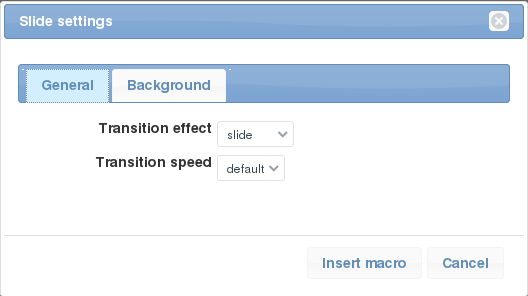
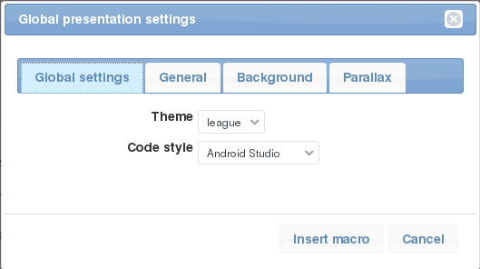

# redmine_reveal
Plugin that transforms Redmine wiki pages in presentations.

This plugin was inspired by the [redmine-presentation plugin](https://github.com/florentsolt/redmine-presentation), with which is almost compatible.

Presentations are build around the excellent [revealjs](https://github.com/hakimel/reveal.js/) Javascript library.

## Requirements

- Requires v3.0.0+. Tested with Redmine v3.1.4, v3.2.4, v3.3.3 and v3.4.0.

## Installation

- install the `redmine_reveal` plugin:

      cd $REDMINE_HOME/plugins
      git clone https://github.com/mikitex70/redmine_reveal.git

- restart Redmine to load the new plugin

## Usage

There are five macros that can be used to transform wiki pages in presentations.

Some macros have a button on the editor toolbar; this buttons will open a dialog to insert the macro text in an easy way, helping to set the desired options.

Placing the cursor on a macro body and clicking on the correct macro button, the dialog will open again with fields pre-filled from the macro parameters. This can simplify changing parameter values (there are a lot of options).

### `slide`

This macro adds a slide to the presentation. The macro body will be used as the slide body.

When the first slide is added to the page, a link `Presentation` (may be translated) will appear to the upper right corner.

Example usage:

    {{slide
    h2. Slide title

    This is the slide description:

    * can be used the normal textile syntax
    * use slide options to customize slides
    }}

    This text will not be shown in the slide.

The text outside the slide macros will still appear in the wiki page, but will not be rendered in the presentation. This can be used to insert notes/explanations in the wiki page and at the same time keep the slides clean and simple.

This previous macro example will be rendered in the wiki page as:

Notice the `Presentation` link in the upper right corner.

Once the macro in inserted in the wiki page, place the cursor somewhere in the macro and click the *Slide* toolbar button for an easy options change:

### `subSlide`

This macro is similar to the `slide` macro, but add a so called *sub-slide* to the preceding slide.

For detail on *sub-slide* see the [revealjs documentation](https://github.com/hakimel/reveal.js/).

Example usage:

    {{slide
    }}

    {{subslide
    h2. This is the first subslide
    }}

    {{subslide
    h2. This is the second subslide
    }}

    {{subslide
    h2. This is the last subslide
    }}

Note that the main slide is empty: if you put text in the slide then it will appear in all the sub-slides. This can be used to add some common heading to the sb-slides.

### `speakerNote`

The `speakerNote` macro marks some text as to be shown in the [Speaker note window](https://github.com/hakimel/reveal.js/#speaker-notes) of the previous slide/subslide.

Speaker notes can be used to give some suggestion to the speaker on what to say, optional arguments, etc.

To show the *Speaker notes window* start the presentation and then press the `S` key.

Example usage:

    {{slide
    h2. Slide with speaker notes

    Here is the text for the presentation
    }}

    {{speakerNote
    This text is visible only in the *Speaker view*.

    * can be used any textile formatting
    }}

### `slideSetup`

This macro is used to setup some default values that can be used for all slides, instead to specify the same value for every slide.

Example usage:

    {{slideSetup(theme=beige,transition=fade)}}

Once the macro in inserted in the wiki page, place the cursor somewhere in the macro and click the *Slide setup* toolbar button for an easy options change:

Some of the options specified with the `slideSetup` macro can be overriden in the `slide` or `subslide` macros.

### `comment`

The `comment` macro can be used to hide rendering of part of the wiki page. Can be used to hide a slide, but also in all other wiki pages.

Example usage:

    {{comment
    {{slide
    h2. Hidden slide

    This slide will not be rendered.
    }}

Note that the nested macro must be closed only once: macros cannot be nested, but if for some reason you need to use a macro in a slide, the inner macro must be closed with the `}\}` sequence.
